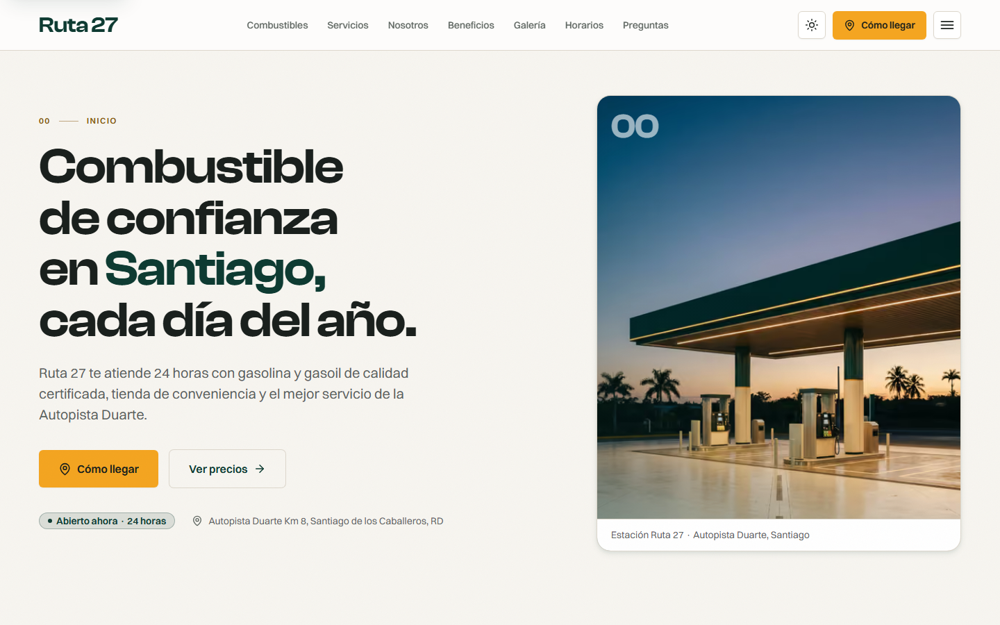
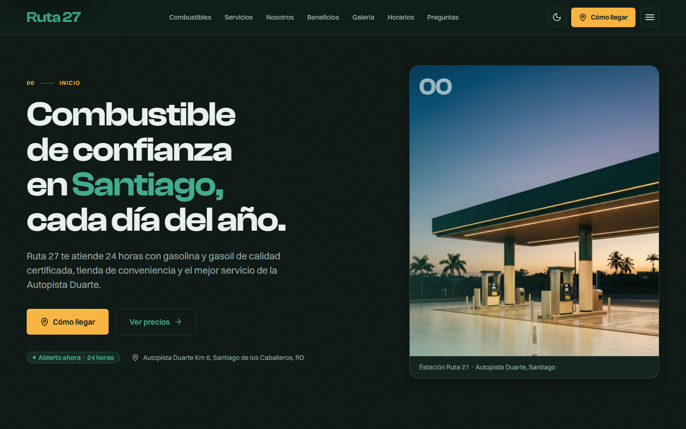
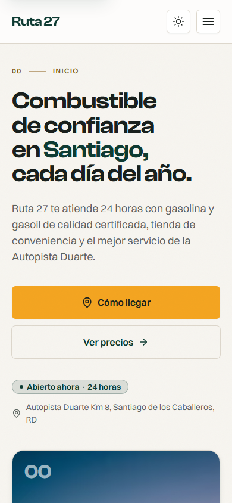
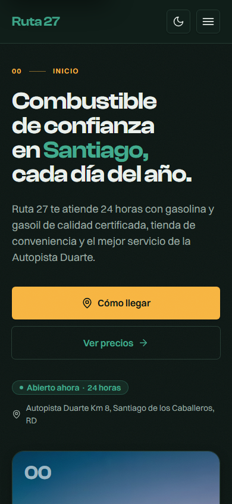

<div align="center">

# Ruta 27 — Estación de Servicio

**_Energía para seguir tu ruta._**

Landing corporativa de una sola página para una estación de servicio en la Autopista Duarte,
Santiago (República Dominicana). Estática, accesible y rápida, con modo claro/oscuro,
mapa interactivo y formulario sin backend.

[**Ver demo en vivo →**](https://ruta27-estacion.pages.dev)

[](https://github.com/juanandrescj-dev/ruta27-estacion/actions/workflows/ci.yml)


[](./LICENSE)



</div>

> [!NOTE]
> **Sitio demostrativo de portafolio.** «Ruta 27» es una marca **ficticia**; el nombre, los
> datos, los precios y las imágenes son ilustrativos y no representan a ningún negocio real.
> Las fotografías se generaron con IA y se dirigieron/retocaron para una estética editorial
> coherente con la marca.

---

## Vistazo

<table>
  <tr>
    <td width="50%"></td>
    <td width="25%"></td>
    <td width="25%"></td>
  </tr>
  <tr>
    <td align="center"><em>Escritorio · oscuro</em></td>
    <td align="center"><em>Móvil · claro</em></td>
    <td align="center"><em>Móvil · oscuro</em></td>
  </tr>
</table>

## Características

- **Modo claro / oscuro** por atributo `data-theme`, con toggle de 3 estados (claro · oscuro ·
  sistema) y **sin flash** (script anti-FOUC `is:inline` que se reaplica tras cada View Transition).
- **Mapa interactivo** (MapLibre GL + OpenFreeMap, sin API key) con carga diferida, estilo
  sincronizado con el tema, marcador de marca y botones «Abrir en Google Maps / Waze». Fallback
  accesible si la red falla.
- **Formulario de contacto** vía Web3Forms (sin backend) con honeypot anti-spam, `autocomplete`,
  envío asíncrono y feedback accesible (`role="status"`), más WhatsApp como canal primario.
- **Galería** con _masonry_ ligero y **lightbox accesible** sobre `<dialog>` nativo (foco
  atrapado, `Escape`, flechas, retorno de foco).
- **SEO técnico**: JSON-LD `GasStation` + `FAQPage` derivados de los **mismos** datos que pinta la
  UI, Open Graph/Twitter, canonical, sitemap y `robots.txt`.
- **Accesibilidad WCAG 2.2 AA** verificada con axe en **ambos temas**; `prefers-reduced-motion`
  respetado (bajo `reduce` no se descarga ni un byte de GSAP/Lenis).
- **Rendimiento**: estático, zero-JS por defecto, imágenes AVIF/WebP responsivas, fuentes
  self-host con `preload`, islas mínimas. Lighthouse móvil **96 / 100 / 100 / 100**.
- **Contenido editable** por el cliente en YAML (`src/data/`), validado con **Zod** en build (si
  un precio es inválido, el build falla).

## Stack y por qué

| Capa              | Decisión                                             | Por qué                                                                                        |
| ----------------- | ---------------------------------------------------- | ---------------------------------------------------------------------------------------------- |
| **Framework**     | **Astro 6** (`output: 'static'`, sin adapter)        | Zero-JS por defecto → Core Web Vitals altos; despliegue estático trivial en Cloudflare Pages.  |
| **Lenguaje**      | **TypeScript** `strict`                              | Señal de calidad y red de seguridad en componentes y utilidades.                               |
| **Estilos**       | **Tailwind CSS v4** (`@tailwindcss/vite`)            | CSS-first (`@theme`), sin `tailwind.config.js`; tokens semánticos como única fuente de verdad. |
| **Islas**         | **React 19** (solo mapa, menú móvil, toggle)         | Interactividad mínima e hidratación selectiva (`client:visible` / `client:idle`).              |
| **Animación**     | **GSAP 3** (ScrollTrigger + SplitText)               | Reveals y parallax sutiles; gratis, y se desactiva por completo bajo `prefers-reduced-motion`. |
| **Smooth scroll** | **Lenis**                                            | Scroll suave artesanal sincronizado con GSAP; off bajo `reduce`.                               |
| **Mapa**          | **MapLibre GL v5** + **OpenFreeMap**                 | Vectorial, estilo custom por tema, sin API key ni límites.                                     |
| **Formulario**    | **Web3Forms** + WhatsApp                             | Envíos sin backend; WhatsApp es el canal natural en RD.                                        |
| **Iconos**        | **`@lucide/astro`** + SVG de dominio propios         | Set de línea coherente; iconos de surtidor/lavado/GLP dibujados a mano (Lucide no los tiene).  |
| **Lint/Format**   | **ESLint 9 (flat) + Prettier 3**                     | `eslint-plugin-astro` + `jsx-a11y`; `prettier-plugin-tailwindcss` ordena clases.               |
| **Testing**       | **Playwright** + `@axe-core/playwright` + **Vitest** | e2e, accesibilidad y regresión visual; Vitest para la lógica pura de `src/lib`.                |
| **Hosting / CI**  | **Cloudflare Pages** + **GitHub Actions**            | Estático con previews por PR; CI con calidad, e2e/a11y/visual y presupuesto Lighthouse.        |

> **Biome** se evaluó como linter/formatter unificado y se **descartó**: a junio de 2026 su
> soporte de archivos `.astro` seguía siendo experimental, y la cobertura de ESLint +
> `eslint-plugin-astro` + Prettier sobre `.astro` es más completa y fiable para este proyecto.

## Estructura

```text
ruta27-estacion/
├── .github/
│   ├── workflows/ci.yml          # quality · e2e/a11y/visual · lighthouse
│   ├── assets/                   # capturas para el README
│   └── PULL_REQUEST_TEMPLATE.md
├── public/                       # favicons, OG, _headers (CSP), fonts/ (woff2 self-host)
├── src/
│   ├── components/
│   │   ├── ui/                   # Button, Card, Badge, Container, Eyebrow + icons/ (SVG dominio)
│   │   ├── sections/             # Hero, Combustibles, Servicios, … , Ubicacion, Contacto
│   │   ├── layout/               # Header, Footer
│   │   └── interactive/          # islas React: MapaInteractivo, MenuMovil, ThemeToggle
│   ├── layouts/BaseLayout.astro  # <head> (SEO, OG, JSON-LD), anti-FOUC, theme-color
│   ├── pages/                    # index.astro · 404.astro
│   ├── data/                     # contenido editable (YAML) validado con Zod
│   ├── styles/                   # tokens.css (fuente única de verdad) · global.css · fonts.css
│   ├── lib/                      # utils (cn, format RD$, horarios) · seo (JSON-LD)
│   └── config/                   # site.ts · nav.ts
└── tests/
    ├── e2e/                      # home, theme, contacto, galeria
    ├── a11y/axe.spec.ts          # 0 violaciones WCAG 2.2 AA en ambos temas
    └── visual/                   # snapshots claro/oscuro (baselines Linux)
```

## Correr en local

Requisitos: **Node 22 LTS** (`.nvmrc`) y **pnpm 11** (`corepack enable pnpm`).

```bash
pnpm install        # instala dependencias
pnpm dev            # servidor de desarrollo → http://localhost:4321
pnpm build          # build estático a dist/
pnpm preview        # sirve el build localmente
```

| Script              | Qué hace                                                    |
| ------------------- | ----------------------------------------------------------- |
| `pnpm typecheck`    | `astro check` (diagnósticos de tipos).                      |
| `pnpm lint`         | ESLint sobre todo el proyecto.                              |
| `pnpm format:check` | Prettier en modo verificación.                              |
| `pnpm test`         | Vitest (lógica pura de `src/lib`).                          |
| `pnpm test:e2e`     | Playwright e2e + accesibilidad (axe) en escritorio y móvil. |
| `pnpm test:visual`  | Regresión visual por snapshots (ver nota abajo).            |

> **Regresión visual:** las _baselines_ se generan en **Linux** (la misma imagen
> `mcr.microsoft.com/playwright` que usa CI) para que casen pixel a pixel con el runner. Para
> regenerarlas: `pnpm test:visual:update` dentro de esa imagen (o en CI). En Windows/macOS el
> render tipográfico difiere, así que `pnpm test:e2e` **no** corre el proyecto visual.

## Decisiones de diseño

El objetivo era que el sitio se viera hecho por un **equipo real de diseño/front**, no por un
generador. Resumen de las decisiones intencionales (detalle en [`CLAUDE.md`](./CLAUDE.md)):

- **Paleta.** Verde-petróleo `#0E3B32` (confianza, combustible) + ámbar de señalización vial
  `#F4A521` (energía, movimiento). **Cero morado/índigo**. Nada de `#FFF`/`#000` puros: el fondo
  es blanco roto cálido `#F7F5F0`. Todo color sale de `src/styles/tokens.css` (OKLCH); ningún
  color hardcodeado fuera de ahí.
- **Tipografía.** Dos voces con contraste: **Clash Display** (titulares, numeración editorial) +
  **Switzer** (texto), de Fontshare, self-host en `.woff2`. Inter solo como _fallback_.
- **Modo oscuro por luminosidad, no inversión.** Tres capas de tokens (`primitivos` → `semánticos`
  por tema → puente `@theme inline`, obligatorio para que el dark mode reaccione en runtime). Las
  superficies elevadas se **aclaran**; el verde de marca sube luminosidad para mantener contraste
  AA; `theme-color` y `color-scheme` siguen al tema elegido (no al del SO).
- **Anti-«look IA».** Layouts asimétricos (hero 7/5, bento de pesos distintos), alineación
  izquierda dominante, numeración editorial `00 → 09`, microcopy dominicano concreto (RD$,
  Autopista Duarte, galón exacto, 24/7), iconos de línea (cero emojis), grano/textura sutil,
  sombras direccionales con tinte de marca y radios variados (pill solo en _badges_).

## Lighthouse (móvil)

Medido con Lighthouse 12 (móvil, _throttling_ simulado) sobre el build de producción.

| Métrica            | Resultado | Presupuesto |
| ------------------ | --------- | ----------- |
| **Performance**    | **96**    | ≥ 90        |
| **Accessibility**  | **100**   | ≥ 95        |
| **Best Practices** | **100**   | —           |
| **SEO**            | **100**   | ≥ 95        |
| CLS                | **0**     | < 0.1       |
| TBT                | **20 ms** | < 300 ms    |
| LCP                | ~1.4 s¹   | < 2.5 s     |

> ¹ LCP observado con _throttling_ aplicado (Slow 4G + 4× CPU) en un trazado de Chrome DevTools.
> Bajo el _throttling_ simulado y pesimista de Lighthouse ronda los 2.5 s; por eso en el
> presupuesto de CI (`lighthouserc.json`) LCP/FCP/TBT son advertencias y las métricas estables
> (categorías y CLS) son errores que bloquean.

## Calidad y CI

Cada push/PR a `main` ejecuta [tres trabajos](./.github/workflows/ci.yml):

1. **Calidad** — ESLint + Prettier (`format:check`) + `astro check` + `build`.
2. **e2e · a11y · visual** — Playwright (escritorio + móvil), `@axe-core/playwright` (0
   violaciones WCAG 2.2 AA en ambos temas) y regresión visual; corre dentro de la imagen oficial
   de Playwright para que las capturas casen con las _baselines_.
3. **Lighthouse CI** — presupuesto Core Web Vitals (`treosh/lighthouse-ci-action`).

## Autor

**Juan Andrés** — Frontend Developer
[github.com/juanandrescj-dev](https://github.com/juanandrescj-dev)

## Licencia

[MIT](./LICENSE) © 2026 Juan Andrés. Tipografías Clash Display y Switzer bajo licencia de
Fontshare (ver `public/fonts/LICENSE-Fontshare.txt`).
